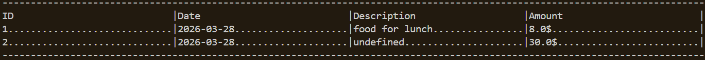
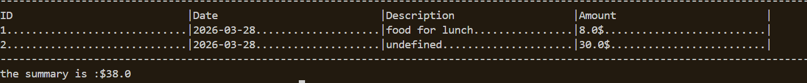

# Expense Tracker CLI Application

### A simple expense tracker application to manege you finances, user can add and delete and update and view their expenses with the date , and summary for all time or for specific month

## Features

- Add expenses with a description and amount
- Update , Delete by ID
- List all recorded expenses
- View a summary of total expenses, and a monthly summary filtered by month

## Requirement

- Python 3.10+
- No external dependencies - uses only the standard library

## installation

```bash
# Clone the repo
git clone https://github.com/majed43/Expense-tracker

# Navigate into the project folder
cd expense-tracker
```

## Usage

### Add an expense

```bash
python expense-tracker.py add --amount 10 --description "food for lunch"
# Expense added successfully :1
```

### Add without description

```bash
python expense-tracker.py add --amount 30
# Expense added successfully :2
```

### update an expense

```bash
python expense-tracker.py update --id 1 --amount 8
# 1 expense updated successfully
```

### Show all expenses

```bash
python expense-tracker.py list
```



### Show the summary

```bash
python expense-tracker.py summary
```



### show summary for specific month

```bash
python expense-tracker.py summary --month 3
```

### Delete an expense

```bash
python expense-tracker.py delete --id 1
# 1 expense has been deleted successfully
```

## Data storage

Expenses are stored locally in a `expense.csv` file that automatically created on first run.

## What I learned

- Dealing with `argparse` tools with subcommands in CLI app
- Reading and writing structured data with `csv.DictReader` and `csv.DictWriter`

## The challenge link

https://roadmap.sh/projects/expense-tracker
